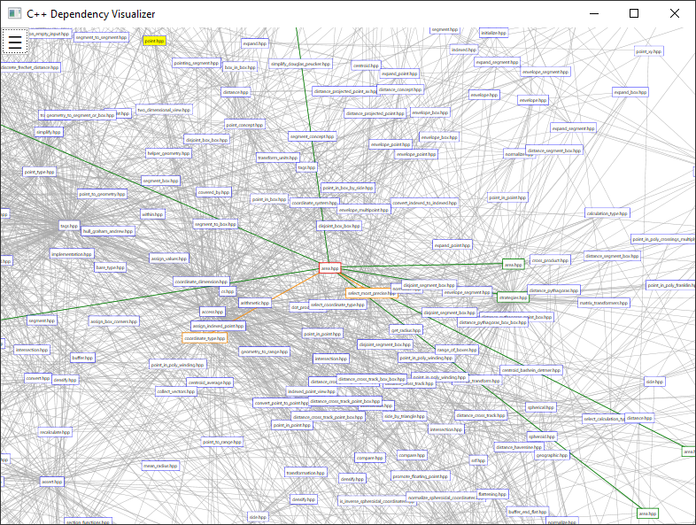
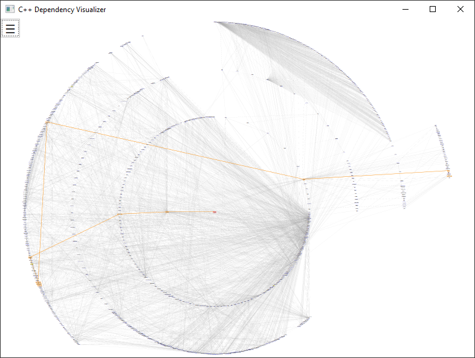
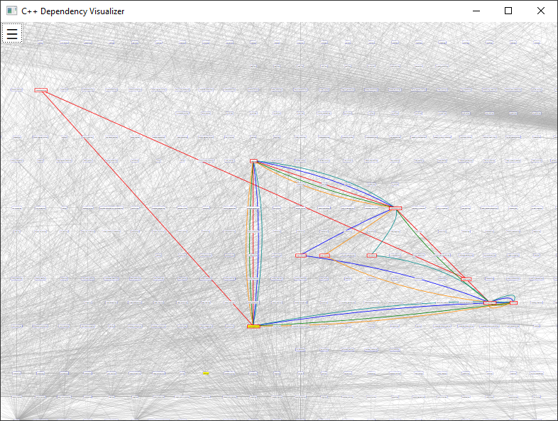
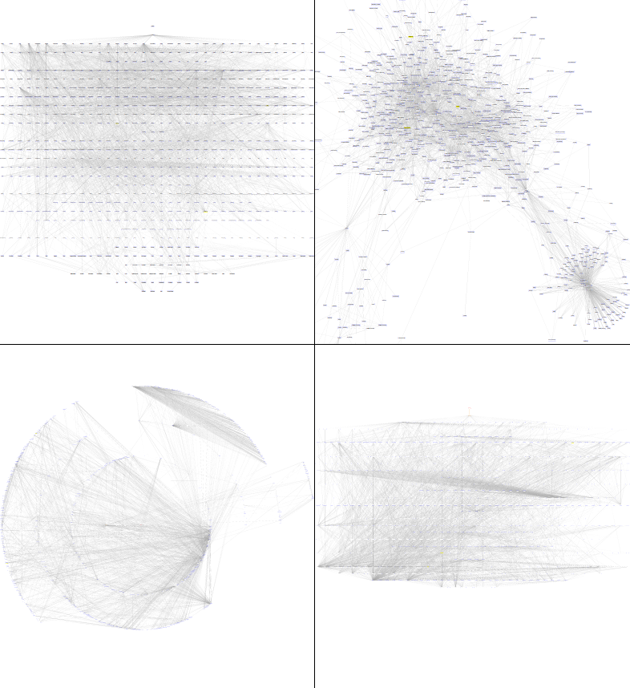

# C++ Dependency Visualizer

Left mouse + drag - move the graph

Mouse wheel - zoom graph on mouse cursor

Left mouse click on a header - display red connections to children (including) and green connections to parents (included by) of this header.

Left mouse click on one header followed by shift + left mouse click on second header - display first found path between headers.

Right mouse click on the canvas followed by choosing "Find All Cycles" from the context menu - display all cycles of headers.

Layout and other options can be changed in menu.

